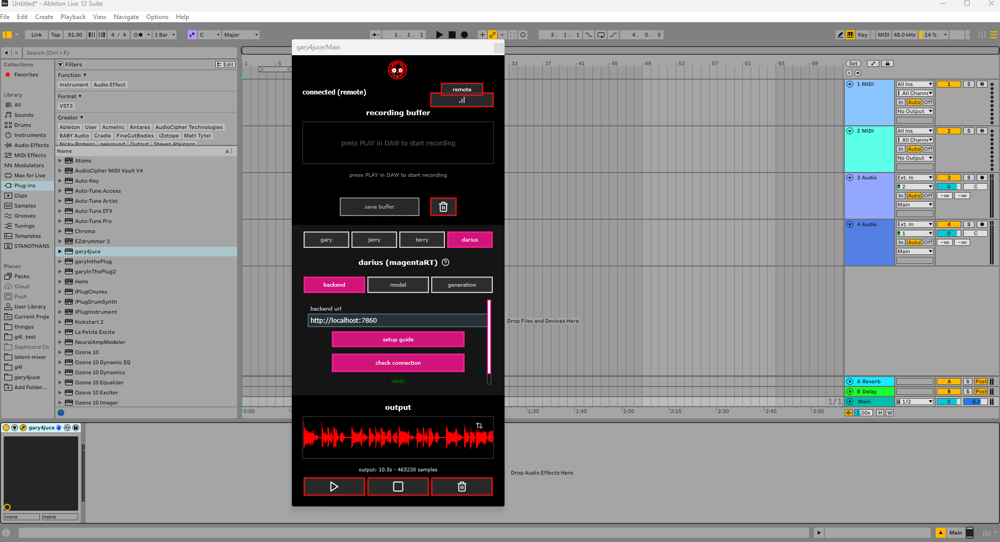

# magenta-rt backend for gary4juce

docker images for running google's magenta-realtime as a local backend, primarily designed for [gary4juce](https://thepatch.gumroad.com/l/gary4juce) but includes a web tester and continuous jamming endpoints for other applications.



## what this does

this is the "darius" backend for gary4juce - a JUCE VST/AU plugin that generates music continuations using magenta-realtime. the plugin sends audio from your DAW to this backend, which returns 4/8/16 bar continuations using the specified styles/weights.

**also included:**
- real-time websocket streaming for web applications (`/ws/jam`) - no input audio required
- continuous jamming endpoints for iOS/mobile apps (and eventually the DAW) (`/jam/start`, `/jam/next`) - input audio required
- model swapping support for custom finetunes
- web-based tester interface at `/tester` - uses /ws/jam ('rt mode')

## requirements

**GPU:**
- **recommended:** 32-48GB+ VRAM for real-time generation (L40s, A100, H100)
- **minimum:** 24GB VRAM for gary4juce (L4, RTX 4090, A5000)
  - with 24GB you'll get full quality but won't hit real-time speeds
  - that's fine for DAW use - you can wait a few seconds for generations

**important notes:**
- the arm64 dockerfile still requires CUDA despite targeting ARM architecture
- this means you **cannot build the arm64 image on a Mac** (no NVIDIA GPU/CUDA)
- arm64 has been tested on DGX Spark (ARM64 + NVIDIA GPU)
- x86 has been tested on HuggingFace L4/L40s infrastructure

## quick start

### 1. clone the repo
```bash
git clone https://github.com/betweentwomidnights/magenta-rt.git
cd magenta-rt-backend
```

### 2. build the image

**for x86_64 (most consumer GPUs):**
```bash
docker build -f Dockerfile.x86 -t magenta-rt:latest .
```

**for arm64 (DGX Spark, Grace Hopper, etc):**
```bash
docker build -f Dockerfile.arm64 -t magenta-rt:latest .
```

### 3. run the container
```bash
docker run -it --rm --gpus all --shm-size=16g -p 7860:7860 magenta-rt:latest
```

the backend will be available at `http://localhost:7860`

### 4. configure gary4juce

in the gary4juce plugin UI:
1. open the darius settings
2. enter backend URL: `http://localhost:7860`
3. start generating!

## using with gary4juce

the plugin uses the `/generate` endpoint to create musical continuations based on your DAW loop. here's what happens:

1. gary4juce captures audio from your DAW track
2. sends it to `/generate` with style parameters
3. backend generates 4/8/16 bars that continue your loop
4. plugin receives the audio and can insert it back into your DAW

**generation parameters:**
- `bpm`: tempo of your loop
- `bars`: how many bars to generate (4, 8, or 16)
- `styles`: comma-separated genre tags (e.g., "acid house, techno")
- `style_weights`: optional weights for each style
- `loop_weight`: how much to match the input loop's vibe (0.0-2.0)
- `temperature`: randomness (lower = safer, higher = wilder)
- `topk`: limits token choices (40 is a good default)
- `guidance_weight`: how strongly to follow the style prompt

## custom finetunes

you can train your own magenta-rt models and use them through this backend.

### training workflow

we provide two methods for training: **Google Colab** (easiest) and **Docker-based training** (for those with powerful GPUs).

---

#### method 1: google colab (recommended for most users)

1. **train your model** using the official magenta-rt colab:
   - [MagentaRT Fine-tuning Notebook](https://colab.research.google.com/github/magenta/magenta-realtime/blob/main/notebooks/Magenta_RT_Finetune.ipynb)
   - this creates checkpoint folders like `checkpoint_1861001/`, `checkpoint_1862001/`, etc
   - also generates steering assets: `cluster_centroids.npy`, `mean_style_embed.npy`

2. **package checkpoints correctly**

checkpoints must be compressed as `.tgz` files to preserve `.zarray` files.

⚠️ **critical:** do not download checkpoint folders directly from Google Drive - the `.zarray` files won't transfer properly.

use this in a colab cell to package correctly:

```python
# mount drive to access your trained checkpoints
from google.colab import drive
drive.mount('/content/drive')

# set the path to your checkpoint folder
CKPT_SRC = '/content/drive/MyDrive/your_project/checkpoint_1862001'

# copy folder to local storage (preserves dotfiles)
!rm -rf /content/checkpoint_1862001
!cp -a "$CKPT_SRC" /content/

# verify .zarray files are present
!find /content/checkpoint_1862001 -name .zarray | wc -l

# create properly formatted .tgz archive
!tar -C /content -czf /content/checkpoint_1862001.tgz checkpoint_1862001

# verify critical files are in the archive
!tar -tzf /content/checkpoint_1862001.tgz | grep -c '.zarray'

# download the .tgz file
from google.colab import files
files.download('/content/checkpoint_1862001.tgz')
```

---

#### method 2: docker-based training (for power users)

if you have access to a GPU with **~42GB+ VRAM** (tested on DGX Spark), you can train locally using our Docker images.

**GPU requirements for training:**
- **observed usage:** ~41GB VRAM during training (DGX Spark)
- **recommended:** rent a GPU on [RunPod](https://runpod.io) if you don't have adequate hardware
- **note:** consumer GPUs (RTX 4090, etc) typically don't have enough VRAM for training

**build the training image:**

```bash
# for x86_64 GPUs (untested but based on proven inference setup)
docker build -f Dockerfile.finetune_x86 -t magenta-finetune:latest .

# for arm64 GPUs (tested on DGX Spark with Blackwell GB10)
docker build -f Dockerfile.finetune_arm64 -t magenta-finetune:latest .
```

**step 1: prepare your dataset**

organize your audio files (MP3 or WAV) in a folder, then run `prepare_data.py`:

```bash
docker run --gpus all \
  -v ~/my_audio_dataset:/data:ro \
  -v ~/magenta_finetune_outputs:/outputs \
  magenta-finetune:latest \
  python prepare_data.py \
    --audio_dir /data \
    --output_dir /outputs \
    --task_name my_model
```

this will create:
- `my_model_examples.recordio` - tokenized audio data
- `cluster_centroids.npy` - for steering controls
- `mean_style_embed.npy` - for steering controls

**step 2: train the model**

```bash
docker run --gpus all \
  -v ~/magenta_finetune_outputs:/outputs \
  magenta-finetune:latest \
  python train.py \
    --task_name my_model \
    --output_dir /outputs \
    --num_steps 6000
```

⚠️ **critical:** the `task_name` must match between prepare_data and train steps!

training will create timestamped folders containing checkpoints (e.g., `20251113_1743/checkpoint_1861001/`).

**step 3: package checkpoints for huggingface**

```bash
cd ~/magenta_finetune_outputs/20251113_1743

# archive each checkpoint to .tgz (required for proper .zarray preservation)
for ckpt in checkpoint_*; do
  echo "Archiving $ckpt..."
  tar -czf ${ckpt}.tgz $ckpt
  echo "Verifying ${ckpt}.tgz..."
  echo "  .zarray files: $(tar -tzf ${ckpt}.tgz | grep -c '.zarray')"
done
```

**step 4: fix permissions (docker runs as root)**

```bash
sudo chown -R $USER:$USER ~/magenta_finetune_outputs
```

your output folder will contain:
```
magenta_finetune_outputs/
├── 20251113_1743/
│   ├── checkpoint_1861001.tgz
│   ├── checkpoint_1862001.tgz
│   └── ...
├── cluster_centroids.npy
├── mean_style_embed.npy
└── my_model_examples.recordio
```

---

### uploading to huggingface

regardless of training method, upload these files to your HuggingFace model repo:

**required files:**
- `checkpoint_*.tgz` (one or more checkpoints)
- `cluster_centroids.npy` (for steering controls)
- `mean_style_embed.npy` (for steering controls)

**example repo:** [thepatch/magenta-ks](https://huggingface.co/thepatch/magenta-ks)

**⚠️ important:** do not upload raw checkpoint folders - always use `.tgz` archives to preserve `.zarray` files!

### using your finetune

select your model using the `/model/select` endpoint:

```bash
curl -X POST http://localhost:7860/model/select \
  -H 'Content-Type: application/json' \
  -d '{
    "ckpt_repo": "your-username/your-model",
    "ckpt_step": 1862001,
    "size": "large",
    "prewarm": true
  }'
```

or use environment variables when starting the container:

```bash
docker run -it --rm --gpus all --shm-size=16g -p 7860:7860 \
  -e MRT_CKPT_REPO="your-username/your-model" \
  -e MRT_CKPT_STEP="1862001" \
  -e MRT_SIZE="large" \
  magenta-rt:latest
```

## web tester

access the real-time web tester at `http://localhost:7860/tester`

this provides a browser-based interface for experimenting with magenta-rt in real-time mode (similar to the google colab demos). you can:
- generate music in real-time via websockets
- adjust temperature, topk, and guidance weight live
- switch between models and checkpoints
- test custom finetunes

## additional endpoints

while gary4juce is the primary use case, the backend includes other endpoints:

### one-shot generation
- `POST /generate` - main endpoint (used by gary4juce)
- `POST /generate_style` - experimental generation without input audio (requires BPM)

### continuous jamming (for mobile apps)
- `POST /jam/start` - start continuous generation session
- `GET /jam/next` - get next audio chunk
- `POST /jam/consume` - mark chunk as consumed
- `POST /jam/stop` - end session
- `POST /jam/update` - update parameters mid-session
- `POST /jam/reseed` - inject new audio context

### websocket streaming
- `WS /ws/jam` - real-time streaming (used by web tester)
  - supports both "rt mode" (continuous streaming) and "bar mode" (bar-aligned chunks)

### model management
- `POST /model/select` - switch between base and finetuned models
- `GET /model/status` - check current model configuration
- `GET /model/checkpoints` - list available checkpoints from HF repo
- `POST /model/assets/load` - load steering assets (centroids, mean embeds)

### utilities
- `GET /health` - check if GPU is available and model is loaded
- `GET /progress?request_id=<id>` - poll generation progress
- `GET /docs` - auto-generated API documentation

## untitled jamming app

the continuous jamming endpoints (`/jam/*`) power an iOS app currently in TestFlight. if you're interested in trying it:
- email: kev@thecollabagepatch.com
- join our discord: https://discord.gg/T8HVqwQw6T

## technical details

**audio format:**
- 48 kHz stereo output
- ~2.0s chunks with ~40ms crossfade
- 4/8/16 bar chunks have varying length based on input BPM

**model sizes:**
- `base` and `large` variants available
- we didn't notice speedup using `base` vs `large` for generation time

**real-time performance:**
- L40S recommended for true real-time streaming
- L4 will experience slight delays but works fine for DAW workflows

**memory requirements:**
- **inference:** 24GB minimum for standard generation, 30+GB for sustained real-time streaming
- **training:** ~42GB VRAM observed (recommend 48GB+ for headroom)

## troubleshooting

**GPU not detected:**
```bash
# check if nvidia-docker is properly installed
docker run --rm --gpus all nvidia/cuda:12.0.0-base-ubuntu22.04 nvidia-smi
```

**out of memory:**
- reduce `bars` parameter (try 4 instead of 8)
- close other GPU applications
- consider upgrading to GPU with more VRAM
- note: even on a T4 i found it doesn't OOM it's just REAL slow.

**slow generation:**
- this is expected with <32GB VRAM
- first generation after model load is slower (compilation/warmup)
- subsequent generations will be faster

**connection refused:**
- wait 30-60 seconds after `docker run` for model to load
- check logs: `docker logs <container-id>`
- verify port 7860 isn't already in use

## support

having trouble? reach out:
- email: kev@thecollabagepatch.com
- discord: https://discord.gg/PKj2aaDhFe
- github issues: (this repo)

## credits

built on google's [magenta-realtime](https://github.com/magenta/magenta-realtime) (Apache 2.0 + CC-BY 4.0)

developed by [thecollabagepatch](https://thecollabagepatch.com) - open source AI audio tools

gary4juce available at: https://thepatch.gumroad.com/l/gary4juce